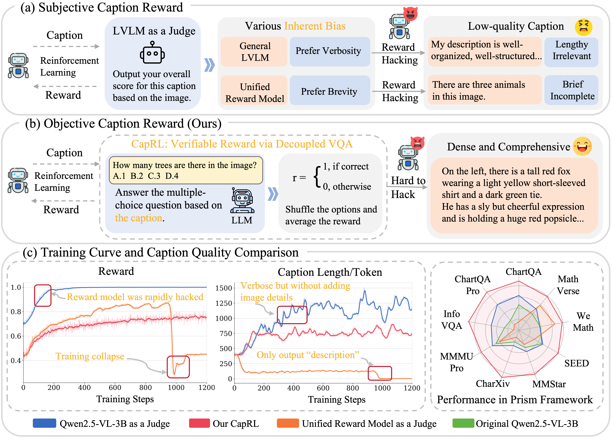
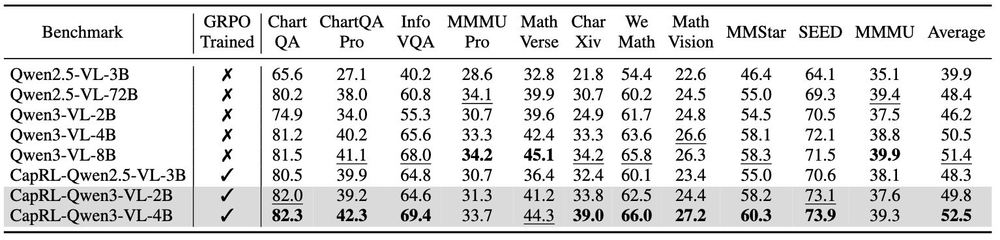
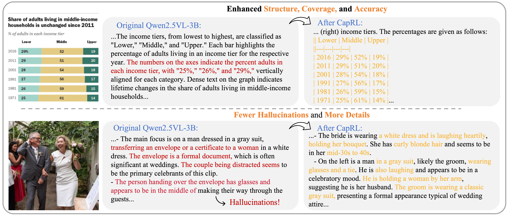
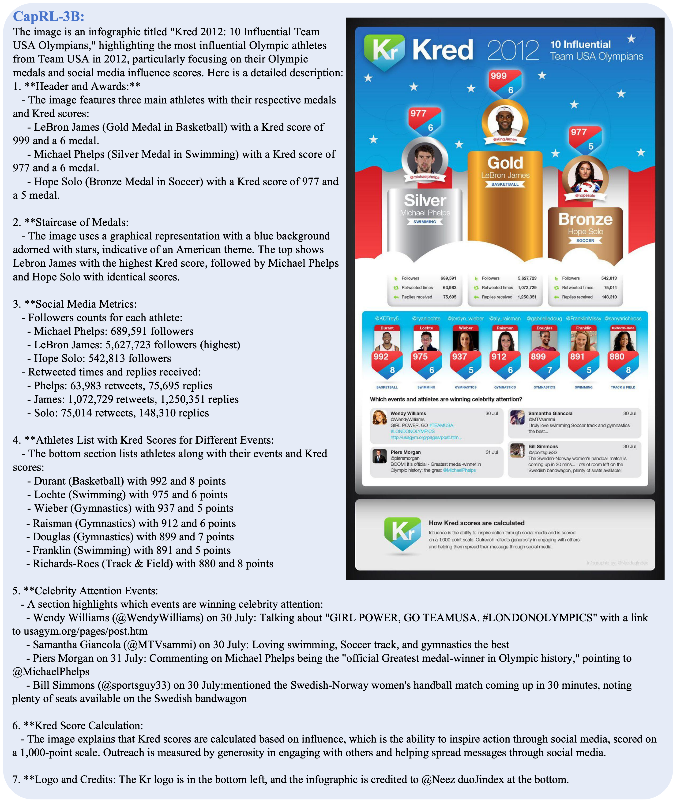
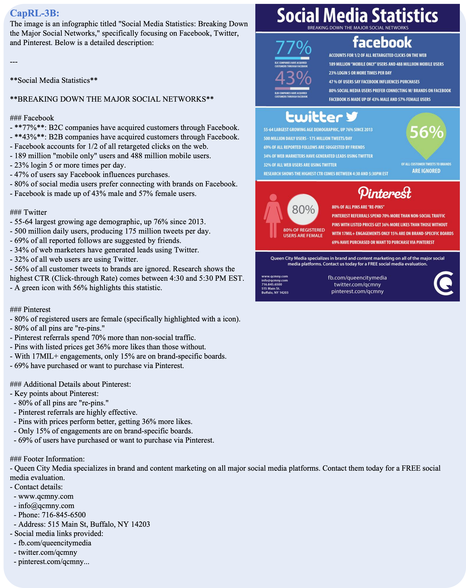

<p align="center">
<!--   <h1 align="center"></h1> -->
  <h1 align="center">(ICLR 2026)CapRL: Stimulating Dense Image Caption Capabilities via Reinforcement Learning</h1>
    <p align="center">
    <a href="https://github.com/Cooperx521"><strong>Long Xing*</strong></a>
    ·
    <a href="https://lightdxy.github.io/"><strong>Xiaoyi Dong*</strong></a>
    ·
    <a href="https://yuhangzang.github.io/"><strong>Yuhang Zang</strong></a>
    ·
    <a href="https://scholar.google.com/citations?user=sJkqsqkAAAAJ"><strong>Yuhang Cao</strong></a>
    ·
    <a href="https://scholar.google.com/citations?user=P4yNnSkAAAAJ&hl=zh-TW"><strong>Jianze Liang</strong></a>
    ·
    <a href="https://github.com/shikiw"><strong>Qidong Huang</strong></a>
    ·
  <a href="https://myownskyw7.github.io/"><strong>Jiaqi Wang</strong></a> ·
  <a href="https://scholar.google.com/citations?user=5bInRDEAAAAJ&hl=zh-CN"><strong>Feng Wu</strong></a> ·
  <a href="http://dahua.site/"><strong>Dahua Lin</strong></a>

  <h2 align="center">CapRL++: Unified Reinforcement Learning with Verifiable Rewards for Dense Image and Video Captioning</h2>
    <p align="center">
    <a href="https://yph22.github.io/"><strong>Penghui Yang*</strong></a>
    ·
    <a href="https://github.com/Cooperx521"><strong>Long Xing*</strong></a>
    ·
    <a href="https://lightdxy.github.io/"><strong>Xiaoyi Dong</strong></a>
    ·
    <a href="https://yuhangzang.github.io/"><strong>Yuhang Zang</strong></a>
    ·
    <a href="https://scholar.google.com/citations?user=sJkqsqkAAAAJ"><strong>Yuhang Cao</strong></a>
    ·
    <a href="https://codegoat24.github.io/"><strong>Yibin Wang</strong></a>
    ·
    <a href="https://github.com/YujieOuO/"><strong>Yujie Zhou</strong></a>
    ·
    <a href="https://bujiazi.github.io/"><strong>Jiazi Bu</strong></a>
    ·
    <a href="https://scholar.google.com/citations?user=P4yNnSkAAAAJ&hl=zh-TW"><strong>Jianze Liang</strong></a>
    ·
    <a href="https://github.com/shikiw"><strong>Qidong Huang</strong></a>
    ·
    <a href="https://myownskyw7.github.io/"><strong>Jiaqi Wang</strong></a>
    ·
    <a href="https://scholar.google.com/citations?user=5bInRDEAAAAJ&hl=zh-CN"><strong>Feng Wu</strong></a>
    ·
    <a href="http://dahua.site/"><strong>Dahua Lin</strong></a>
    </p>


[](https://arxiv.org/abs/2606.09393)
[](https://arxiv.org/abs/2509.22647)
[](https://github.com/InternLM/CapRL)
[](https://huggingface.co/collections/long-xing1/caprl-68d64ac32ded31596c36e189)

#### CapRL Series Model & Dataset
| Series | Models & Resources |
| :--- | :--- |
| **CapRL 3.0 Series (CapRL++)** |[](https://arxiv.org/abs/2606.09393) \|  [🤗 CapRL-Video-4B](https://huggingface.co/internlm/CapRL-Video-4B) \| [📊 CapRL-Video-178K Dataset](https://huggingface.co/datasets/internlm/CapRL-Video-178K) |
| **CapRL 2.0 Series** | [🤗 CapRL-Qwen3VL-2B](https://huggingface.co/internlm/CapRL-Qwen3VL-2B) \| [🤗 CapRL-Qwen3VL-4B](https://huggingface.co/internlm/CapRL-Qwen3VL-4B) \| [📦 CapRL-Qwen3VL-2B-GGUF](https://huggingface.co/internlm/CapRL-Qwen3VL-2B-GGUF) \| [📦 CapRL-Qwen3VL-4B-GGUF](https://huggingface.co/internlm/CapRL-Qwen3VL-4B-GGUF) \| [🌈CapRL-Qwen3VL-4B Space](https://huggingface.co/spaces/yuhangzang/CapRL-Qwen3VL-4B)
| **CapRL 1.0 Series** | [](https://arxiv.org/abs/2509.22647) \|[🤗 CapRL-Qwen2.5VL-3B](https://huggingface.co/internlm/CapRL-3B) \| [🤗 CapRL-InternVL3.5-8B](https://huggingface.co/yuhangzang/CapRL-InternVL3.5-8B) \| [📊 CapRL-2M Dataset](https://huggingface.co/datasets/internlm/CapRL-2M) \| [📦 CapRL-3B-GGUF](https://huggingface.co/mradermacher/CapRL-3B-GGUF) \| [📦 CapRL-3B-i1-GGUF](https://huggingface.co/mradermacher/CapRL-3B-i1-GGUF) \| [🌈CapRL-Qwen2.5VL-3B Space](https://huggingface.co/spaces/yuhangzang/caprl)

**CapRL 3.0 series (CapRL++)**: **CapRL-Video-4B** has been released! CapRL++ extends the original image-caption RL framework to a unified image and video captioning paradigm with verifiable rewards.

We are excited to release the **CapRL 2.0 series**: **CapRL-Qwen3VL-2B** and **CapRL-Qwen3VL-4B**. These models feature fewer parameters while delivering even more powerful captioning performance. 
Notably, **CapRL-Qwen3VL-2B outperforms both CapRL-Qwen2.5VL-3B and Qwen2.5VL-72B in captioning tasks, while CapRL-Qwen3VL-4B further demonstrates a significant performance leap over the 2B version.**
This improvement in efficiency is driven by our upgraded training recipe, which includes a more rigorous QA data filter and a significantly more diverse image dataset. We welcome everyone to try them out!


When selecting between the available CapRL models, it's essential to consider the trade-off between performance and computational cost.
This guide will help you choose the most suitable model for your specific needs:
|Model|Parameters|Strength|
|-|-|-|
|🤗[CapRL-Qwen3VL-2B](https://huggingface.co/internlm/CapRL-Qwen3VL-2B)|2B|Speed, Efficiency|
|🤗[CapRL-Qwen3VL-4B](https://huggingface.co/internlm/CapRL-Qwen3VL-4B)|4B|High Performance, Advanced Captioning Ability|
|🤗[CapRL-Video-4B](https://huggingface.co/internlm/CapRL-Video-4B)|4B|Extremely Dense Video Captioning|

Now you can try out CapRL with your own images🎨!&nbsp;&nbsp;&nbsp;&nbsp;➡️&nbsp;&nbsp;&nbsp;&nbsp;[🌈CapRL-Qwen2.5VL-3B Space](https://huggingface.co/spaces/yuhangzang/caprl) and [🌈CapRL-Qwen3VL-4B Space](https://huggingface.co/spaces/yuhangzang/CapRL-Qwen3VL-4B).


## 📢 News
We are working on even stronger base models and upgrading our training recipe — stay tuned!
- 🔥 [06/08/2026] **CapRL++** paper is available on arXiv: [CapRL++: Unified Reinforcement Learning with Verifiable Rewards for Dense Image and Video Captioning](https://arxiv.org/abs/2606.09393).
- 🔥 [05/25/2026] We have released the training and evaluation code for CapRL++. See more in `CapRL++` folder.
- 🔥 [05/22/2026] We have released the **[CapRL-Video-QA-20K](https://huggingface.co/datasets/internlm/CapRL-Video-QA-20K)** dataset for CapRL++ training and 
the **[CapRL-Video-178K](https://huggingface.co/datasets/internlm/CapRL-Video-178K)** dataset (recaptioned by **[CapRL-Video-4B](https://huggingface.co/internlm/CapRL-Video-4B)** from LLaVA-Video-178K)!
- 🔥 [05/22/2026] We have released the **[CapRL-Video-4B](https://huggingface.co/internlm/CapRL-Video-4B)** model (trained on Qwen3-VL-4B) designed for video captioning! Demo is [here](https://internlm.github.io/CapRL/demo/).
- 🔥 [04/16/2026] We have released the **[CapRL-QA-75K](https://huggingface.co/datasets/internlm/CapRL-QA-75K)** training dataset!
- 🔥 [2/9/2026] We release the CapRL training code.
- 🔥 [1/27/2026] CapRL is accepted by ICLR2026! We are working on cleaning training code, and will release everything as soon as possible!
- 🔥 [12/24/2025] We are excited to release the CapRL 2.0 series: **[CapRL-Qwen3VL-2B](https://huggingface.co/internlm/CapRL-Qwen3VL-2B)** and **[CapRL-Qwen3VL-4B](https://huggingface.co/internlm/CapRL-Qwen3VL-4B)**!
- 🔥 [12/24/2025] The total downloads of the CapRL-related [models and dataset](https://huggingface.co/collections/long-xing1/caprl-68d64ac32ded31596c36e189) reached 17,000!
- 🔥 [10/15/2025] The total downloads of the CapRL-related [models and dataset](https://huggingface.co/collections/long-xing1/caprl-68d64ac32ded31596c36e189) reached 6,000 within just 20 days!
- 🚀 [10/15/2025] We are excited to announce the release of **[CapRL-InternVL3.5-8B](https://huggingface.co/internlm/CapRL-InternVL3.5-8B)**, whose image captioning capability outperforms Qwen2.5-VL-72B!
- 🚀 [10/15/2025] Thanks [mradermacher](https://huggingface.co/mradermacher) for the valuable contribution! [CapRL-3B-GGUF](https://huggingface.co/mradermacher/CapRL-3B-GGUF) is the static quants version, and [CapRL-3B-i1-GGUF](https://huggingface.co/mradermacher/CapRL-3B-i1-GGUF) is weighted/imatrix quants version.
- 🚀 [10/15/2025] We release [QA curation code](https://github.com/InternLM/CapRL).
- 🚀 [09/25/2025] We release **CapRL** repository, [CapRL-3B model](https://huggingface.co/internlm/CapRL-3B), [evaluation code](https://github.com/InternLM/CapRL) and [dataset](https://huggingface.co/datasets/internlm/CapRL-2M).


## Introduction
🌈 We are excited to introduce the **CapRL series**, a family of dense captioning models trained with reinforcement learning rather than conventional supervised caption imitation.

The original **CapRL** framework focuses on dense image captioning. It optimizes an LVLM captioner with QA-derived rewards: a caption is considered high quality when a text-only model can answer visual questions using only that caption. With this recipe, the lightweight **CapRL-3B** achieves perception capabilities comparable to Qwen2.5-VL-72B.

**CapRL++** further generalizes this idea from static images to dynamic videos. It trains a Qwen3-VL-based captioner with a unified RLVR pipeline, where generated captions are evaluated by their downstream utility for multiple-choice visual question answering. For videos, CapRL++ adds timestamp-format rewards and length-aware regularization so the model learns dense, temporally grounded, and non-redundant descriptions.


  </p>

<a href="">
  
</a>
<a href="">
  
</a>


## 💡 Highlights
- 🔥 **Unified dense caption RL for images and videos**: CapRL++ applies the same QA-utility reward philosophy to both image and video captioning, avoiding dependence on a single reference caption.
- 🔥 **Verifiable reward design**: CapRL++ combines visual utility reward, timestamp-format reward, and length-aware penalty to optimize accuracy, temporal structure, and information efficiency.
- 🔥 **Strong temporal grounding**: CapRL-Video-4B generates explicit timestamped video descriptions and improves downstream video understanding when used as caption data.
- 🔥 **Remarkable visual understanding for charts, infographics, and documents**: CapRL-3B achieves perception accuracy and visual information coverage comparable to Qwen2.5-VL-72B.
- 🔥 **Well-organized dense output**: CapRL models generate structured captions that cover fine-grained objects, attributes, OCR content, relations, and events.

## Model Card
- Based on the same recipe as CapRL-3B, we used InternVL3.5-8B as the policy model and obtained CapRL-InternVL3.5-8B through CapRL.
- CapRL-3B-GGUF is static quants version, and CapRL-3B-i1-GGUF is weighted/imatrix quants version. Thanks for their contribution!
- CapRL-Video-4B is trained from Qwen3-VL-4B with CapRL++ for dense video captioning. It is designed to describe both spatial details and temporal event changes with timestamped structure.


## 👨‍💻 Todo

- ✅ Release 75k QA dataset.

## CapRL++: Unified Image and Video Caption RL

CapRL++ is the video-oriented extension of CapRL. It keeps the central principle of CapRL: **a caption should be rewarded by how useful it is for downstream visual question answering**. Instead of comparing a generated caption with a fixed reference, CapRL++ lets the policy model generate captions, then asks a separate vision-free LLM to answer curated multiple-choice questions using only those captions. The answer accuracy becomes a verifiable reward for RL training.

### Reward Design

For a sampled caption `c`, CapRL++ uses a multidimensional reward:

```text
R_total(c) = R_acc(c) + alpha * R_format(c) + beta * R_len(c)
```

- **Visual utility reward (`R_acc`)**: measures whether a text-only LLM can answer image/video MCQs from the generated caption alone. Options are shuffled and sampled multiple times to reduce answer-position bias.
- **Temporal format reward (`R_format`)**: used for video captions. It encourages valid timestamp brackets and chronological ordering, helping the model produce temporally grounded narratives.
- **Length-aware reward (`R_len`)**: discourages reward hacking through overly long or repetitive captions, pushing the model toward high information density.

### Static-to-Dynamic Bootstrapping

CapRL++ uses **S2D-Boot**, a two-stage image-to-video training recipe:

1. **Image stage**: train on static images with visual utility and length rewards to strengthen fine-grained spatial perception, OCR, attributes, and relation extraction.
2. **Video stage**: initialize from the image-stage checkpoint and train on video data with the full reward space, including timestamp-format reward, so optimization can focus on event ordering and temporal localization.

This progressive strategy preserves strong image captioning ability while improving video understanding.

### CapRL++ Datasets

- **[CapRL-Video-QA-20K](https://huggingface.co/datasets/internlm/CapRL-Video-QA-20K)**: multiple-choice video QA data for CapRL++ reward training.
- **[CapRL-Video-178K](https://huggingface.co/datasets/internlm/CapRL-Video-178K)**: LLaVA-Video-178K videos recaptioned by **[CapRL-Video-4B](https://huggingface.co/internlm/CapRL-Video-4B)** with dense, timestamped descriptions.

### Code Entry Points

The CapRL++ implementation is in [`CapRL++`](CapRL++):

```text
CapRL++/
├── train/
│   ├── scripts/        # reward service and verl training launch scripts
│   └── verl/           # bundled verl backend with video caption RL recipe
└── eval/
    ├── scripts/        # Prism video evaluation scripts
    ├── tools/          # benchmark judge helpers
    └── README.md
```

For details, see:

- [`CapRL++/README.md`](CapRL++/README.md)
- [`CapRL++/train/scripts/README.md`](CapRL++/train/scripts/README.md)
- [`CapRL++/eval/README.md`](CapRL++/eval/README.md)

## 🛠️ Setup

### Installation

For CapRL image training and evaluation:

```bash
git clone https://github.com/InternLM/CapRL.git
cd CapRL/CapRL_Training
conda create -n CapRL python=3.10
conda activate CapRL
bash setup.sh
```

The `setup.sh` will sequentially:
1. Install key dependencies with pinned versions (torch, transformers, vllm, deepspeed, flash-attn, ray, etc.)
2. Install the OpenRLHF-based training framework and remaining dependencies via `pip install -e .`

For CapRL++ video training and evaluation:

```bash
cd CapRL/CapRL++/train
conda create -n caprl python=3.10 -y
conda activate caprl
pip install -r scripts/requirements.txt
pip install -e ./verl
```

Video Prism evaluation dependencies are installed separately:

```bash
cd CapRL/CapRL++/eval
pip install -r requirements.txt
```

## ⭐️ Quick Start
If you want to use **CapRL-3B** for captioning, you can directly follow the exact same inference approach as in [Qwen2.5-VL-series](https://github.com/QwenLM/Qwen3-VL/tree/d2240f11656bfe404b9ba56db4e51cd09f522ff1).

The prompt we use for training and evaluation is `Please describe this image in detail.`

We recommend using **vLLM** to speed up inference.

For **CapRL-Video-4B**, use the Qwen3-VL video inference interface or the Prism evaluation scripts under `CapRL++/eval`. A typical video caption prompt is:

```text
Please describe this video in detail.
```


### Start an OpenAI API Service

Run the command below to start an OpenAI-compatible API service:

```bash
vllm serve "/PATH/CapRL-3B" \
    --trust-remote-code \
    --tensor-parallel-size=1 \
    --pipeline-parallel-size=1 \
    --gpu_memory_utilization=0.95 \
    --served-model-name=caprl \
    --port 8000 \
    --host 0.0.0.0
```

Then you can use the chat API as below: (see [OpenAI API protocol document](https://platform.openai.com/docs/guides/vision/uploading-base-64-encoded-images) for more details):
```python
import base64
from openai import OpenAI
# Set OpenAI's API key and API base to use vLLM's API server.
openai_api_key = "EMPTY"
openai_api_base = "http://localhost:8000/v1"
client = OpenAI(
    api_key=openai_api_key,
    base_url=openai_api_base,
)
image_path = "/path/to/local/image.png"
with open(image_path, "rb") as f:
    encoded_image = base64.b64encode(f.read())
encoded_image_text = encoded_image.decode("utf-8")
base64_qwen = f"data:image;base64,{encoded_image_text}"
chat_response = client.chat.completions.create(
    model="caprl",
    messages=[
        {
            "role": "user",
            "content": [
                {
                    "type": "image_url",
                    "image_url": {
                        "url": base64_qwen
                    },
                },
                {"type": "text", "text": "Please describe this image in detail."},
            ],
        },
    ],
    temperature=1.0,
    max_tokens=max_tokens,
    top_p=1.0,
    extra_body={
        "repetition_penalty": 1.0,
        },
)
print("Chat response:", chat_response)
```
## QA Curation

This part of the code is in the `QA_data_curation` folder, which contains all four steps for generating QA data:

1. **QA generation.** Use Qwen2.5-VL-72B to generate 5 QAs for each image. The generation process launches a vLLM service and uses multi-threading to speed up.
2. **QA extraction.** Extract QAs through format matching.
3. **Qwen2.5-VL-3B answer question.** Use Qwen2.5-VL-3B to answer questions with and without images. The parameter `ROTATE_NUM` controls how many times each question is answered. If a question is answered only once, the randomness may be too high and can easily lead to misjudgment.
4. **Filter question.** We keep QA pairs with `visual acc` higher than 0.75 and `text acc` lower than 0.25 to avoid data leakage and ensure the model can correctly answer questions when images are provided.


## CapRL Training

All training scripts are located in `CapRL_Training/scripts/`. Taking `qwen2.5vl3b_75k_reward_qwen2.5_3b` as an example:

**Step 1: Start the reward server**

```bash
cd CapRL_Training
bash scripts/qwen2.5vl3b_75k_reward_qwen2.5_3b/reward/rjob.sh
```

Once the reward server is running, note its **IP address**.

**Step 2: Launch training**

Set `<REWARD_SERVER_IP>` in `training/launch.sh` to the IP from Step 1, then:

```bash
bash scripts/qwen2.5vl3b_75k_reward_qwen2.5_3b/training/rjob.sh
```


> **Note:** The training scripts require `vllm>=0.11.0` for Qwen3-VL compatibility. However, the reward server using Qwen2.5/Qwen3 LLM may occasionally encounter issues with higher vLLM versions. We recommend running the reward server in a separate conda environment with a lower version such as `vllm==0.10.1`.

**A note on migrating CapRL to other codebases:** Our training code is built on OpenRLHF, which originally lacked VLM (e.g., Qwen3-VL) RL training support. We added VLM adaptation and CapRL's two-stage reward on top of it. If you prefer a more lightweight alternative, consider using [VeRL](https://github.com/volcengine/verl), which natively supports VLM training — you only need to customize the reward computation (e.g., by querying a vLLM reward server). If there is demand for VeRL integration, please open an issue to let us know.

## Pretraining

### Datasets

Our **CapRL-2M** dataset is available on :
[🔗 Hugging Face](https://huggingface.co/datasets/internlm/CapRL-2M)

It includes images from [ShareGPT-1M](https://huggingface.co/datasets/Lin-Chen/ShareGPT4V) and [DenseFusion-1M](https://huggingface.co/datasets/BAAI/DenseFusion-1M), with high-quality captions re-annotated using CapRL-3B, totaling 2M samples.

In our JSONL files, we provide the captions along with their corresponding image paths. The images can be downloaded from ShareGPT-1M and DenseFusion-1M.


### Reproducing Pretraining Experiments

To reproduce the pretraining experiments presented in our paper:

1. **Initialize Qwen2.5-VL.**
   Follow the steps in the notebook [`initiallize_vlm_3b.ipynb`](https://github.com/Cooperx521/ScaleCap/blob/892ad0682defa37f54833c3c4284a9d9a5c3451e/grocery_file/initiallize_vlm_3b.ipynb) to set up the Qwen2.5-VL model for training.

2. **Training.**
   We use [LLaMA-Factory](https://github.com/hiyouga/LLaMA-Factory) for pretraining. The training scripts are provided in `Pretraining_exp/scripts/`, covering all 3 stages:
   - `Stage0_initial_align.sh` — Initial alignment with LLaVA-558K
   - `Stage1_further_pretrain.sh` — Further pretraining with CapRL-1M caption data
   - `Stage2_sft.sh` — SFT with general instruction data, Open-LLaVA-NeXT-1M


## Comparing Caption Quality via Prism Framework

We evaluate caption quality by **decoupling the traditional VQA (Visual Question Answering) task**:

1. First, a model generates a **caption** for the image.
2. Then, a **language model** answers questions based solely on the generated caption.

This approach allows us to assess the **informational quality and completeness** of the generated captions — if the language model can accurately answer visual questions based only on the caption, then the caption is likely high-quality.

The complete evaluation scripts can be found in the `Prism_Evaluation` folder, with the core implementation located in `Eval_CapRL.py`.

The Prism evaluation files are available at [CapRL-Evaluation-Files](https://huggingface.co/datasets/internlm/CapRL-Evaluation-Files). The dataset contains `json_file/` for the evaluation JSON files and `bench_image_folder.zip` for the corresponding images.

```bash
huggingface-cli download internlm/CapRL-Evaluation-Files --repo-type dataset --local-dir CapRL-Evaluation-Files
cd CapRL-Evaluation-Files
unzip bench_image_folder.zip
```

Use the JSON files under `json_file/` as `--data-path` and pass the dataset root as `--image-root`. The image paths inside each JSON are relative to the dataset root, for example `bench_image_folder/lmm_eval_chartqa/41699051005347.png`.

```bash
python -m Eval_CapRL \
  --data-path /path/to/CapRL-Evaluation-Files/json_file/lmm_eval_chartqa.json \
  --image-root /path/to/CapRL-Evaluation-Files \
  --tag chartqa \
  ...
```


The model used for answering questions based on captions is [CapRL-Eval-3B](https://huggingface.co/internlm/CapRL-Eval-3B), which is a finetuned version of Qwen2.5-VL-3B. When dealing with tasks such as ChartQA (not multiple-choice questions), it provides more stable output formatting.

You can specify `--reward-model-path` as the path to **CapRL-Eval-3B** in `Eval_CapRL.py`.


### Cases
<a href="">
  
</a>

<a href="">
  
</a>
<a href="">
  
</a>
<a href="">
  
</a>

## 📄 License
  

**Usage and License Notices**: The data and code are intended and licensed for research use only.
License: Attribution-NonCommercial 4.0 International It should abide by the policy of OpenAI: https://openai.com/policies/terms-of-use

## Citation

If you find CapRL++ useful for your research, please consider citing:

```bibtex
@article{yang2026caprlplusplus,
  title={CapRL++: Unified Reinforcement Learning with Verifiable Rewards for Dense Image and Video Captioning},
  author={Yang, Penghui and Xing, Long and Dong, Xiaoyi and Zang, Yuhang and Cao, Yuhang and Wang, Yibin and Zhou, Yujie and Bu, Jiazi and Liang, Jianze and Huang, Qidong and Wang, Jiaqi and Wu, Feng and Lin, Dahua},
  journal={arXiv preprint arXiv:2606.09393},
  year={2026}
}
```

For the original CapRL paper:

```bibtex
@article{xing2025caprl,
  title={CapRL: Stimulating Dense Image Caption Capabilities via Reinforcement Learning},
  author={Xing, Long and Dong, Xiaoyi and Zang, Yuhang and Cao, Yuhang and Liang, Jianze and Huang, Qidong and Wang, Jiaqi and Wu, Feng and Lin, Dahua},
  journal={arXiv preprint arXiv:2509.22647},
  year={2025}
}
```

## ❤️ Acknowledgments
- [Open-LLaVA-NeXT](https://github.com/xiaoachen98/Open-LLaVA-NeXT): Thanks for the impressive open-source dataset.
- [VLMEvalKit](https://github.com/open-compass/VLMEvalKit): the amazing open-sourced suit for evaluating various LMMs!
